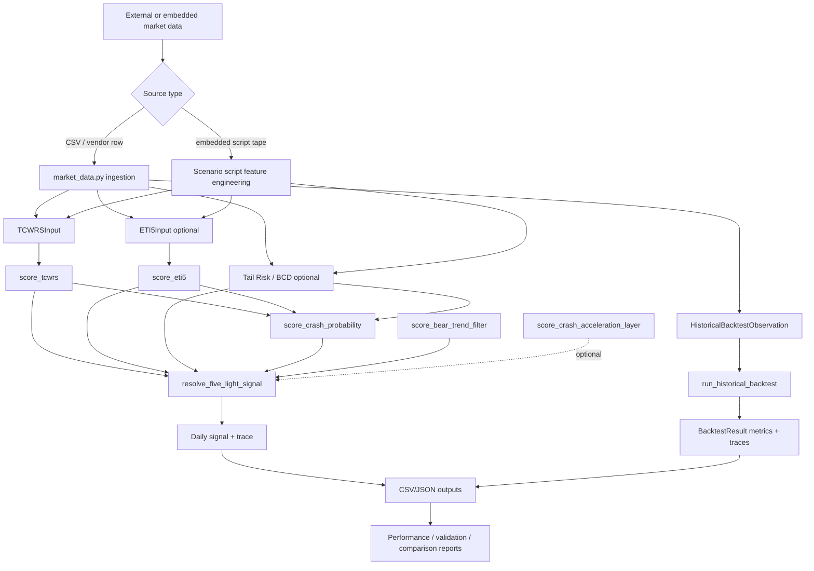
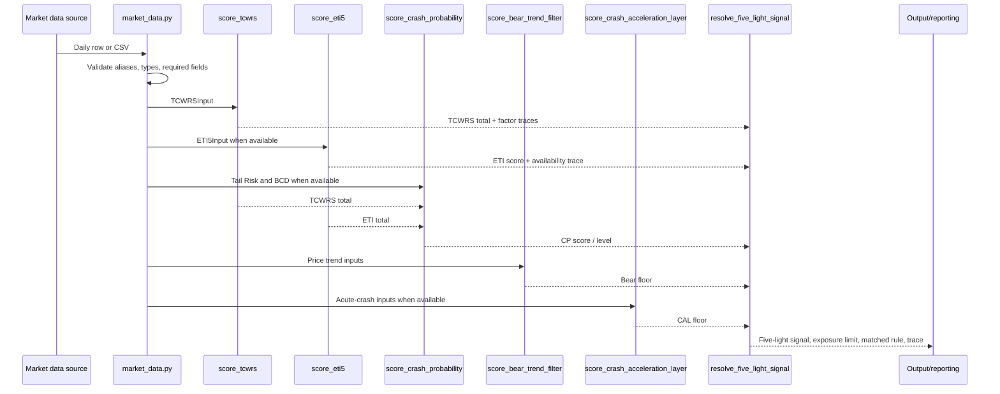
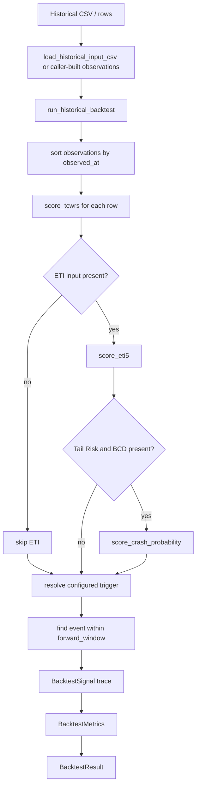
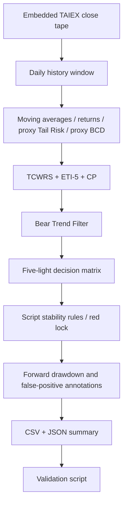
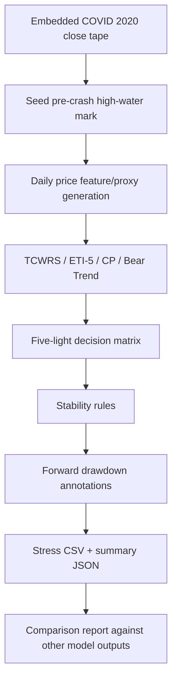
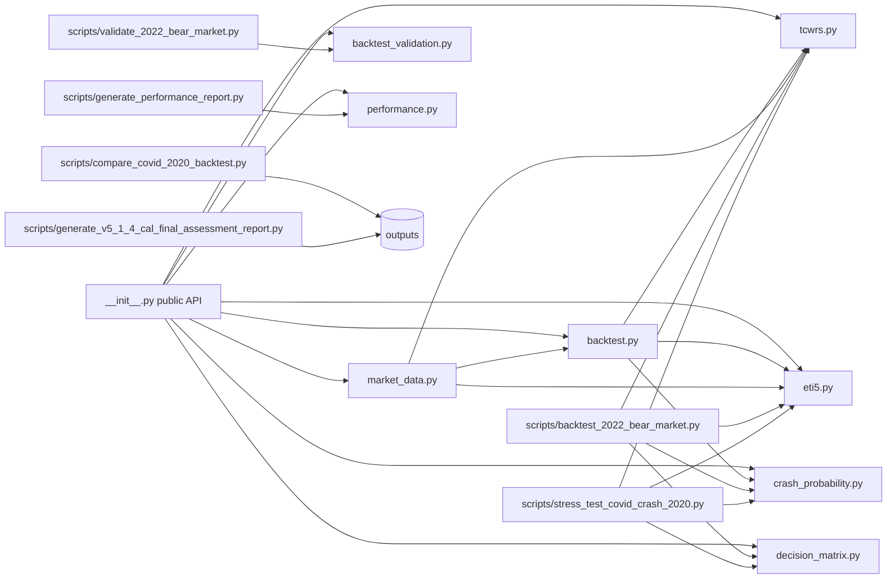

# TDT-RM Architecture

This document describes the current TDT-RM repository architecture as implemented in code. It is intentionally limited to documentation and does not redefine or modify model logic.

## 1. Repository structure

```text
.
├── README.md
├── TDT-RM-V5.1.3-Rev3-Final-Freeze.md
├── TDT-RM-V5.1.4-Backtest-Calibration-Patch.md
├── docs/
│   ├── TDT_RM_ARCHITECTURE.md
│   └── TDT_RM_ROADMAP.md
├── outputs/
│   ├── *_backtest.csv
│   ├── *_summary.json
│   ├── *_performance_report.{json,md}
│   └── *_comparison_report.md
├── scripts/
│   ├── backtest_2022_bear_market.py
│   ├── compare_covid_2020_backtest.py
│   ├── generate_performance_report.py
│   ├── generate_v5_1_4_cal_final_assessment_report.py
│   ├── stress_test_covid_crash_2020.py
│   └── validate_2022_bear_market.py
├── src/tdt_rm/
│   ├── __init__.py
│   ├── backtest.py
│   ├── backtest_validation.py
│   ├── crash_probability.py
│   ├── decision_matrix.py
│   ├── eti5.py
│   ├── market_data.py
│   ├── performance.py
│   └── tcwrs.py
└── tests/
    ├── test_backtest.py
    ├── test_backtest_validation.py
    ├── test_crash_probability.py
    ├── test_decision_matrix.py
    ├── test_eti5.py
    ├── test_final_assessment_report.py
    ├── test_market_data.py
    ├── test_performance.py
    └── test_tcwrs.py
```

### Directory responsibilities

| Path | Responsibility |
| --- | --- |
| `src/tdt_rm/` | Importable, dependency-free model and framework package. |
| `scripts/` | Runnable scenario, validation, comparison, and reporting entry points. |
| `outputs/` | Generated CSV, JSON, Markdown, and HTML artifacts from historical runs. |
| `tests/` | Unit and acceptance-style tests covering implemented modules and scripts. |
| root specs/reports | Frozen model specifications and previously generated validation reports. |

## 2. Major implemented components

### 2.1 TDT-RM core model orchestration

The current core model is assembled from scoring layers rather than from a single monolithic object:

1. TCWRS computes the structural risk score.
2. ETI-5 computes exit-trigger confirmation.
3. Crash Probability combines TCWRS, ETI-5, Tail Risk, and BCD into an auxiliary crash-probability score.
4. The five-light decision matrix resolves a final signal and exposure band.
5. Bear Trend Filter and CAL can raise the signal through non-downgrading floors.

The public package API in `src/tdt_rm/__init__.py` re-exports these dataclasses and scorer functions for consumers. The scripts use that API to build daily scenario runs.

### 2.2 TCWRS

Implemented in `src/tdt_rm/tcwrs.py`, TCWRS is the repository's core scoring module. It scores eight sub-factors and aggregates them to a 0-100 total:

| Factor | Meaning | Max score |
| --- | --- | ---: |
| P | Price trend and downside speed | 18 |
| V | Volume and price-volume efficiency | 12 |
| F | Foreign investor spot/futures/options hedging | 15 |
| X | TWD and cross-border capital flow | 12 |
| M | Margin leverage and retail risk | 12 |
| B | Market breadth deterioration | 12 |
| L | Large-cap/mainstream stock health | 10 |
| G | Global risk and external pressure | 9 |

Design characteristics:

- Inputs are represented by the frozen `TCWRSInput` dataclass.
- Each factor returns `TCWRSFactorResult` with `code`, `name`, `max_score`, `score`, `matched_rule`, `conditions`, and `trace_output`.
- `score_tcwrs()` calls all eight factor scorers and returns a `TCWRSResult` with `total_score`, `factor_scores`, and `factor_traces`.
- Several predicates that do not have a universal raw-data definition are passed as explicit booleans, keeping the implementation vendor-neutral and auditable.

### 2.3 TCWRS vs BCD boundary

The TCWRS breadth factor handles downside breadth deterioration when the index is down or below MA20. Index-up breadth deterioration is intentionally kept out of TCWRS and should be handled by BCD. This boundary is noted in README and enforced by tests.

### 2.4 ETI-5

Implemented in `src/tdt_rm/eti5.py`, ETI-5 is a five-component binary exit-trigger index:

| Code | Component |
| --- | --- |
| ETI-1 | Index below 20MA |
| ETI-2 | Foreign selling |
| ETI-3 | TWD depreciation |
| ETI-4 | Breadth deterioration |
| ETI-5 | Leadership breakdown |

Design characteristics:

- `ETI5Input` stores direct component inputs and optional `available_components`.
- `score_eti5()` returns `ETI5Result` with raw score, capped score, available count, cap reason, triggered signals, and per-component trace output.
- V5.1.4 availability caps prevent price-only tapes from fabricating unavailable ETI components.

### 2.5 Tail Risk

Tail Risk is currently represented as an input/proxy score rather than as a standalone package module:

- In the generic framework it is an optional numeric input on `HistoricalBacktestObservation` and `MarketDataObservation`.
- In `scripts/backtest_2022_bear_market.py` and `scripts/stress_test_covid_crash_2020.py`, Tail Risk is derived from price-only proxies such as drawdown, volatility, and short-window downside movement.
- In Crash Probability and the decision matrix, Tail Risk is consumed as a 0-100 scalar.

Current architectural status: implemented as a consumed data field and scenario-script proxy, not as a formal reusable scorer module.

### 2.6 BCD

BCD is also currently represented as an input/proxy score rather than as a standalone package module:

- In the generic framework it is an optional numeric input on historical and market-data observations.
- In scenario scripts, BCD is approximated from drawdown, distance below MA20, and consecutive-down-day pressure.
- In Crash Probability and the decision matrix, BCD is consumed as a 0-100 scalar.

Current architectural status: implemented as a consumed data field and scenario-script proxy, not as a formal reusable scorer module.

### 2.7 MHS

MHS is present only at integration boundaries:

- `DecisionMatrixInput` includes `mhs` with default `0.0`.
- The five-light decision matrix uses `mhs >= 86` and `mhs >= 71` in strengthened-yellow and yellow rules.

Current architectural status: no standalone MHS scoring module exists in `src/tdt_rm/`; callers must provide an MHS score if they want MHS to influence the decision matrix.

### 2.8 Bear Trend Filter

Implemented in `src/tdt_rm/decision_matrix.py`:

- `BearTrendInput` contains close, MA20, MA60, previous MA60, and 60-day return.
- `score_bear_trend_filter()` scores four slow-bear conditions.
- The result is a non-downgrading signal floor: score 2 floors to Yellow, score 3 to Strengthened Yellow, score 4 to Orange.
- The filter is deliberately separate from TCWRS and is applied after base five-light resolution.

### 2.9 CAL

The Crash Acceleration Layer is implemented in `src/tdt_rm/decision_matrix.py`:

- `CrashAccelerationInput` contains short-window return, drawdown velocity, volatility expansion, liquidity stress, and limit-down pressure.
- `score_crash_acceleration_layer()` activates only when acute velocity or limit-down pressure is present.
- The result can floor the final signal to Orange or Red without becoming a slow-bear detector.

Current architectural status: reusable core logic exists, but current scenario scripts do not pass CAL into `resolve_five_light_signal()`.

### 2.10 Crash Probability

Implemented in `src/tdt_rm/crash_probability.py`, Crash Probability computes:

```text
CP_raw = TCWRS * 0.40 + (ETI5_total * 20) * 0.30 + TailRisk * 0.20 + BCD * 0.10
CP = min(CP_raw, 100)
```

The result includes `cp_score`, `cp_raw`, `cp_level`, and trace output. Levels are Low, Medium, High, and Extreme.

### 2.11 Five-light decision matrix

Implemented in `src/tdt_rm/decision_matrix.py`, the decision matrix resolves the production-facing signal:

| Signal | Exposure limit |
| --- | --- |
| Green | 80-100% |
| Yellow | 60-80% |
| Strengthened Yellow | 50-70% |
| Orange | 40-50% |
| Red | 20-30% or below |

The resolver applies first-match rules from Red through Green, records a trace, then applies Bear Trend and CAL floors. CP can confirm Red decisions in trace output but does not create Red alone.

### 2.12 Backtest framework

Implemented in `src/tdt_rm/backtest.py`, the generic framework:

- Accepts `HistoricalBacktestObservation` rows.
- Sorts rows by date.
- Scores TCWRS for every row.
- Optionally scores ETI-5 and Crash Probability when inputs are available.
- Applies a configurable signal rule (`any`, `all`, `tcwrs`, `eti5`, or `cp`).
- Looks forward by `forward_window` observations to determine whether an event occurred.
- Computes precision, recall, F1, false-positive rate, hit rate, and average lead days.

### 2.13 2022 backtest scenario runner

Implemented in `scripts/backtest_2022_bear_market.py`, this script embeds a TAIEX close tape, computes price-derived features, scores TCWRS/ETI-5/CP/Bear Trend, resolves five-light signals, applies stability rules, annotates forward drawdowns and false positives, and writes CSV/JSON outputs.

### 2.14 Stress-test framework

Implemented primarily in `scripts/stress_test_covid_crash_2020.py`, the stress framework is structurally similar to the 2022 backtest runner but operates on the 2020 COVID crash window. It:

- Embeds a 2020 TAIEX close tape.
- Uses the same dependency-free price-proxy style as the 2022 runner.
- Scores the same major layers except CAL.
- Applies stability rules and forward drawdown annotations.
- Writes a CSV and JSON summary.

The script-level stress harness is not yet generalized into a reusable `src/tdt_rm/stress_test.py` package module.

### 2.15 Market Data Ingestion Layer

Implemented in `src/tdt_rm/market_data.py`, the ingestion layer is vendor-neutral and dependency-free:

- Accepts mapping rows and CSV files.
- Supports canonical field names, built-in aliases, and caller-provided `field_map`.
- Normalizes rows into `MarketDataObservation` with `TCWRSInput`, optional `ETI5Input`, optional Tail Risk/BCD, event label, metadata, completeness status, and raw-row trace.
- Provides row and CSV validators that collect all row-level validation issues.
- Exposes `historical_input_schema()` for machine-readable CSV schema generation.
- Exposes `load_historical_input_csv()` to bridge ingestion directly into `run_historical_backtest()`.
- Exposes `derive_price_features()` to derive core price features from at least 60 daily bars.

### 2.16 Market Data Downloader

No dedicated market-data downloader exists in the current repository. The current implementation supports ingestion of already available rows/CSVs and embedded historical tapes in scripts. A future downloader should be a separate adapter layer that fetches raw vendor/exchange data and then hands normalized records to `market_data.py`.

### 2.17 Reporting system

Reporting currently exists in several forms:

- `src/tdt_rm/performance.py` computes fully invested vs risk-off strategy performance from a signal CSV.
- `scripts/generate_performance_report.py` writes Markdown and JSON performance reports.
- `scripts/validate_2022_bear_market.py` validates generated artifacts through `backtest_validation.py`.
- `scripts/compare_covid_2020_backtest.py` compares COVID scenario outputs.
- `scripts/generate_v5_1_4_cal_final_assessment_report.py` summarizes requested CAL assessment artifacts.
- Generated reports and summaries are stored in `outputs/` and root-level Markdown/HTML artifacts.

## 3. Data flow diagram



## 4. Daily execution flow

The repository does not yet contain a production scheduler, but the implemented daily flow would be:



Operational notes:

1. Ingestion should run before scoring so missing components can be marked explicitly.
2. TCWRS is required for every model run.
3. ETI-5, Tail Risk, BCD, MHS, Bear Trend, and CAL are optional or caller-supplied depending on data availability.
4. The final production signal should come from `resolve_five_light_signal()`, not directly from raw TCWRS or CP thresholds.
5. Current scripts apply a separate red-lock/stability rule after decision-matrix resolution; that rule is script-local today.

## 5. Backtest execution flow

### Generic framework flow



### 2022 script flow



## 6. Stress-test execution flow



## 7. Module dependency map



### Dependency table

| Module | Depends on | Used by |
| --- | --- | --- |
| `tcwrs.py` | standard library | backtest, ingestion, scenario scripts, tests |
| `eti5.py` | standard library | backtest, ingestion, scenario scripts, CP inputs |
| `crash_probability.py` | standard library | backtest, scenario scripts, decision flow |
| `decision_matrix.py` | standard library | scenario scripts, tests |
| `backtest.py` | TCWRS, ETI-5, Crash Probability | ingestion bridge, tests, downstream callers |
| `market_data.py` | TCWRS, ETI-5, Backtest observation type | CSV ingestion, validation, backtests |
| `backtest_validation.py` | standard library | validation script, tests |
| `performance.py` | standard library | performance report script, tests |
| scenario scripts | package modules plus embedded data | generated outputs and acceptance reports |

## 8. Current limitations

1. **No production scheduler or daily runner.** Daily execution is implied by modules and scripts but not packaged as a single `run_daily` workflow.
2. **No market-data downloader.** The repository ingests rows/CSVs but does not fetch live exchange, broker, FX, futures, options, or breadth data.
3. **Tail Risk and BCD lack standalone reusable scorer modules.** They are consumed as numbers in core modules and approximated in scripts.
4. **MHS lacks a standalone scorer module.** Only the decision-matrix input and thresholds exist.
5. **CAL is not wired into scenario scripts.** Core CAL scorer exists but 2022/COVID scripts currently call `resolve_five_light_signal()` with Bear Trend only.
6. **ETF Exit integration is absent.** No module maps five-light signals or ETI-style exits into ETF-specific exit instructions.
7. **Embedded historical tapes limit reproducibility and extensibility.** Scenario scripts contain hard-coded price histories instead of loading a formal market-data bundle.
8. **Price-only proxies are not formal real-data substitutes.** Current 2022 and COVID scripts approximate Tail Risk, BCD, breadth, and leadership pressure from close-only data.
9. **Reporting is fragmented.** Performance, validation, comparison, and final assessment reports are separate scripts with different output schemas.
10. **No persisted audit database.** Traces are returned in objects and scripts write CSV/JSON artifacts, but there is no durable run registry.
11. **No configuration layer.** Thresholds and paths are mostly dataclass defaults or script argparse defaults.
12. **No dependency-injected data provider interface.** The ingestion layer is vendor-neutral but downloader/provider interfaces are not defined.

## 9. Dead code, duplicate logic, overlapping modules, and technical debt

### 9.1 Dead code / unused implementation risk

| Area | Observation | Risk |
| --- | --- | --- |
| CAL scorer | `score_crash_acceleration_layer()` is exported and tested, but current scenario scripts do not pass a CAL result into `resolve_five_light_signal()`. | CAL can drift from production behavior unless integrated into daily/backtest paths. |
| MHS input | `DecisionMatrixInput.mhs` exists and affects signal rules, but no MHS scorer exists. | Callers may assume MHS is implemented end-to-end when it is only an input slot. |
| Generic backtest vs scenario scripts | `run_historical_backtest()` exists, while scenario scripts implement their own daily loops. | The generic framework may not represent the production five-light path used by scripts. |
| Existing generated artifacts | `outputs/` and root-level reports include historical generated files. | Artifacts may become stale unless regenerated under controlled acceptance flow. |

### 9.2 Duplicate logic

| Duplicate logic | Locations | Suggested consolidation |
| --- | --- | --- |
| Moving averages, percent change, consecutive-down counters | `scripts/backtest_2022_bear_market.py`, `scripts/stress_test_covid_crash_2020.py`, and partially `market_data.derive_price_features()` | Move common price feature helpers into a reusable `src/tdt_rm/features.py` or extend `derive_price_features()`. |
| Price-proxy Tail Risk / BCD formulas | 2022 and COVID scripts | Create explicit provisional proxy scorer functions with documentation and warnings. |
| Stability/red-lock rules | 2022 and COVID scripts | Move to a reusable signal post-processing module if it is intended for production. |
| Forward drawdown annotations | 2022 and COVID scripts | Move to a reusable backtest/stress utility. |
| CSV/JSON report writing | Multiple scripts | Define shared artifact writer/report schema helpers. |

### 9.3 Overlapping modules

| Overlap | Description |
| --- | --- |
| Generic backtest vs scenario backtests | `backtest.py` evaluates threshold signals, while scenario scripts compute five-light signals plus stability rules and drawdown annotations. |
| Market data feature derivation vs script feature derivation | `market_data.derive_price_features()` covers core moving averages/returns, while scripts repeat custom derivation. |
| Performance reporting vs scenario summaries | `performance.py` computes strategy-level metrics, while scenario scripts compute signal counts and drawdown-avoidance summaries. |
| ETI-5 and TCWRS breadth/leadership fields | Some source inputs overlap by design; documentation should clarify whether each field is confirmation, structural risk, or exit trigger. |

### 9.4 Technical debt

1. Hard-coded scenario data should be replaced or supplemented with versioned CSV fixtures.
2. Script-level proxy formulas should be explicitly labeled provisional in generated artifacts.
3. Generated outputs should include code version, config, and data-source metadata.
4. Common feature engineering should be centralized.
5. A production workflow should separate data acquisition, validation, scoring, signal resolution, reporting, and archival.
6. Type aliases or protocols for data providers would make real-data integration easier.
7. Scenario scripts should be aligned with the generic backtest framework or the difference should be documented as intentional.
8. Validation checks are focused on the 2022 scenario; broader acceptance gates are needed for daily production and stress tests.

### 9.5 Missing documentation

1. End-to-end daily production runbook.
2. Real market data source mapping and required vendor fields.
3. Formal Tail Risk scorer definition.
4. Formal BCD scorer definition.
5. Formal MHS scorer definition.
6. CAL integration policy and required acute-crash inputs.
7. ETF Exit mapping and portfolio-action policy.
8. Output artifact schema documentation.
9. Data freshness, missing data, holiday, and partial-session handling.
10. Operational monitoring and alerting policy.

## 10. Future extension points

1. **Daily production runner:** add a `scripts/run_daily_tdt_rm.py` or package service that consumes validated market data and emits a complete signal packet.
2. **Downloader/provider layer:** add provider adapters that write canonical rows accepted by `market_data.py`.
3. **Formal Tail Risk module:** implement a reusable scorer once the real-data definition is finalized.
4. **Formal BCD module:** implement breadth/credit deterioration scoring and keep TCWRS breadth boundaries intact.
5. **Formal MHS module:** implement valuation/market-health scoring and feed `DecisionMatrixInput.mhs`.
6. **CAL production integration:** feed CAL inputs into daily, backtest, and stress flows.
7. **ETF Exit module:** map decision-matrix and ETI outputs into ETF-specific exit/hold/re-entry instructions.
8. **Unified reporting schema:** standardize CSV, JSON, Markdown, and HTML outputs around a shared run manifest.
9. **Run registry:** persist input snapshot, data status, scores, traces, final signal, and generated artifacts for every run.
10. **Expanded validation:** add acceptance gates for daily data completeness, real-data integration, stress scenarios, and candidate releases.
